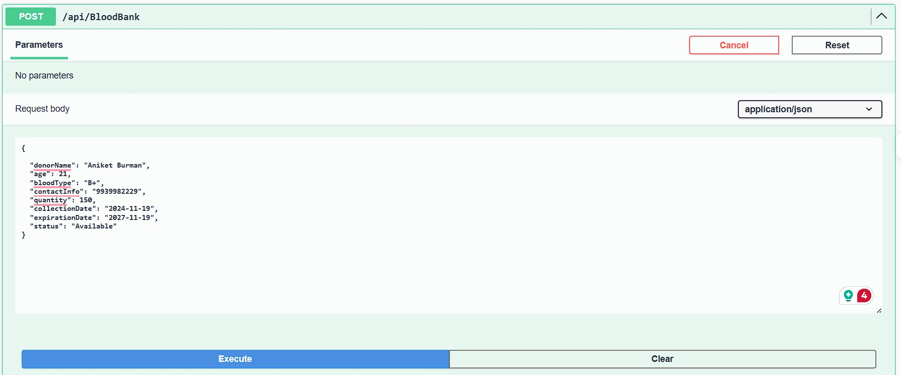

# Blood Bank Management API

This is a RESTful API for managing blood bank records. It allows users to perform CRUD (Create, Read, Update, Delete) operations on blood bank entries, including search functionality with pagination.

## API Endpoints

### 1. **GET /api/bloodbank**

- **Description**: Fetches all blood bank entries.
- **Request Example**:
    ```http
    GET /api/bloodbank
    ```
- **Response Example**:
    ```json
    [
      {
        "id": "b35fe8fc-c5bb-4e59-94cd-c25f5a8f44a7",
        "donorName": "Alice Smith",
        "bloodType": "A+",
        "status": "Available",
        "quantity": 450
      },
      {
        "id": "fc9280ff-9c79-4e1a-8460-93de3c722902",
        "donorName": "Bob Johnson",
        "bloodType": "A+",
        "status": "Available",
        "quantity": 500
      }
    ]
    ```

  
    

---

### 2. **GET /api/bloodbank/{id}**

- **Description**: Fetches a blood bank entry by its `id`.
- **Request Example**:
    ```http
    GET /api/bloodbank/b35fe8fc-c5bb-4e59-94cd-c25f5a8f44a7
    ```
- **Response Example**:
    ```json
    {
      "id": "b35fe8fc-c5bb-4e59-94cd-c25f5a8f44a7",
      "donorName": "Alice Smith",
      "bloodType": "A+",
      "status": "Available",
      "quantity": 450
    }
    ```

    
    

---

### 3. **POST /api/bloodbank**

- **Description**: Creates a new blood bank entry. The `id` is auto-generated by the server.
- **Request Example**:
    ```http
    POST /api/bloodbank
    ```
    **Request Body**:
    ```json
    {
      "donorName": "Charlie Brown",
      "bloodType": "B+",
      "status": "Available",
      "quantity": 500
    }
    ```
- **Response Example**:
    ```json
    {
      "id": "f35fe8fc-c5bb-4e59-94cd-c25f5a8f55f5",
      "donorName": "Charlie Brown",
      "bloodType": "B+",
      "status": "Available",
      "quantity": 500
    }
    ```

    
    

---

### 4. **PUT /api/bloodbank/{id}**

- **Description**: Updates an existing blood bank entry by `id`.
- **Request Example**:
    ```http
    PUT /api/bloodbank/b35fe8fc-c5bb-4e59-94cd-c25f5a8f44a7
    ```
    **Request Body**:
    ```json
    {
      "donorName": "Alice Smith",
      "bloodType": "A+",
      "status": "Expired",
      "quantity": 400
    }
    ```
- **Response Example**:
    ```json
    {
      "id": "b35fe8fc-c5bb-4e59-94cd-c25f5a8f44a7",
      "donorName": "Alice Smith",
      "bloodType": "A+",
      "status": "Expired",
      "quantity": 400
    }
    ```

    
    

---

### 5. **DELETE /api/bloodbank/{id}**

- **Description**: Deletes a blood bank entry by `id`.
- **Request Example**:
    ```http
    DELETE /api/bloodbank/b35fe8fc-c5bb-4e59-94cd-c25f5a8f44a7
    ```
- **Response Example**:
    ```json
    {
      "message": "Blood bank entry deleted successfully."
    }
    ```

    
    

---

### 6. **GET /api/bloodbank/search**

- **Description**: Searches for blood bank entries by various filters (blood type, status, donor name).
- **Query Parameters**:
  - `bloodType`: (Optional) The blood type to search for (e.g., "A+", "O-").
  - `status`: (Optional) The status of the blood (e.g., "Available", "Expired").
  - `donorName`: (Optional) The name of the donor.
- **Request Example**:
    ```http
    GET /api/bloodbank/search?bloodType=A+&status=Available&donorName=Alice
    ```
- **Response Example**:
    ```json
    [
      {
        "id": "b35fe8fc-c5bb-4e59-94cd-c25f5a8f44a7",
        "donorName": "Alice Smith",
        "bloodType": "A+",
        "status": "Available",
        "quantity": 450
      }
    ]
    ```

    
    

---

### 7. **GET /api/bloodbank/search/paginated**

- **Description**: Performs a paginated search on blood bank entries with filters (blood type, status, donor name).
- **Query Parameters**:
  - `page`: (Required) The page number to fetch (starting from 1).
  - `pageSize`: (Required) The number of entries per page.
- **Request Example**:
    ```http
    GET /api/bloodbank/search/paginated?bloodType=A+&status=Available&page=1&pageSize=10
    ```
- **Response Example**:
    ```json
    {
      "totalCount": 25,
      "page": 1,
      "pageSize": 10,
      "data": [
        {
          "id": "b35fe8fc-c5bb-4e59-94cd-c25f5a8f44a7",
          "donorName": "Alice Smith",
          "bloodType": "A+",
          "status": "Available",
          "quantity": 450
        },
        {
          "id": "fc9280ff-9c79-4e1a-8460-93de3c722902",
          "donorName": "Bob Johnson",
          "bloodType": "A+",
          "status": "Available",
          "quantity": 500
        }
      ]
    }
    ```

    
    

---

## Getting Started

1. **Clone the repository**:
    ```bash
    git clone https://github.com/your-username/blood-bank-management-api.git
    cd blood-bank-management-api
    ```

2. **Run the API**:
   - If using Visual Studio:
     - Open the project in Visual Studio.
     - Press `F5` to run the application.
   - If using the terminal:
     ```bash
     dotnet run
     ```

3. **Test the API** using Postman or Swagger UI at `http://localhost:5000`.


